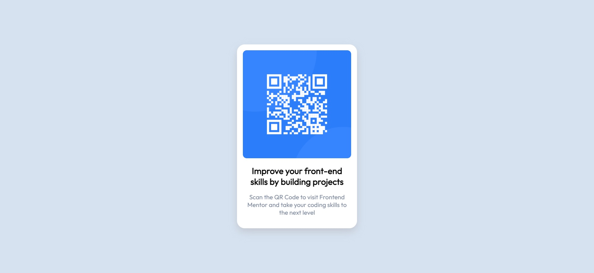

# Frontend Mentor - QR code component solution

This is a solution to the [QR code component challenge on Frontend Mentor](https://www.frontendmentor.io/challenges/qr-code-component-iux_sIO_H). Frontend Mentor challenges help you improve your coding skills by building realistic projects.

## Table of contents

- [Overview](#overview)
  - [Screenshot](#screenshot)
  - [Links](#links)
- [My process](#my-process)
  - [Built with](#built-with)
  - [What I learned](#what-i-learned)
  - [Useful resources](#useful-resources)

## Overview

### Screenshot

### Links

- Solution URL: [My solution on Frontend Mentor](https://www.frontendmentor.io/challenges/qr-code-component-iux_sIO_H/hub/qr-code-challenge-css-1yvsmN_cU)
- Live Site URL: [QR Code Challenge](https://enzozaqueu.github.io/QR-code-component-challenge-hub/)

## My process

### Built with

- Semantic HTML5 markup
- CSS custom properties
- Mobile-first workflow

### What I learned

I had some difficulties when trying to  centralize objects verticaly, but searching about leaded me to discover a unit that take display percents (viewport's height - vh), and then I used it with flex-justify-align so they would be responsive. And also learned about viewport responsive meta element.

### Useful resources

- [Stackoverflow](https://stackoverflow.com/questions/1575141/how-to-make-a-div-100-height-of-the-browser-window) - This helped me on figurint out how to use 100% of the display to centralize a div verticaly.
- [devdocs](https://devdocs.io/css/css_values_and_units) - An documentation about CSS units.
